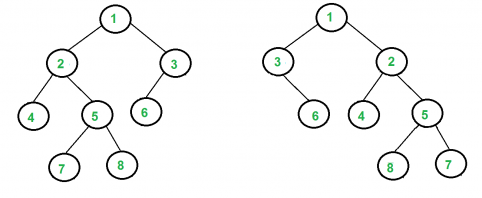

# Determine if two Binary Search Trees are identical.

Write a method on a `BinarySearchTree` class called `areIdentical`. This method takes two root nodes and returns a boolean that represents whether the two Binary Search Trees are identical.

Notes:

- Two trees are identical when they have same data and the arrangement of data is also same.
- It is not necessary that trees having same data are identical trees. Trees having exact same data may not be structurally identical.

Example:


For the tree above:

```js
BinarySearchTree.areIdentical(rootOne, rootTwo);
//True
```



For the tree above:

```js
BinarySearchTree.areIdentical(rootOne, rootTwo);
//False
```

Companies that have asked this question: -
