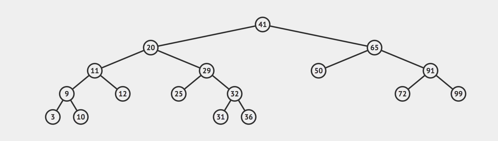

# Max Depth Of A Binary Search Tree

Write a method on a `BinarySearchTree` class called `maxDepth`. This method should return a number which is the max depth of the BST.

You have been provided with a `BinarySearchTree` class, as well as a `BSTNode` class.

Definition:

The `maximum depth` is the number of nodes along the longest path from the root node down to the `farthest leaf node` - Leetcode

Notes:

- You can assume all values are unique

Example 1:



```js
let bst = new BinarySearchTree();
let nodeValues = [41, 20, 65, 11, 29, 9, 12, 25, 32, 3, 10, 31, 36, 50, 91, 72, 99];

nodeValues.forEach(val => bst.insert(val));

bst.maxDepth(); // should return 5
```

Example 2:


```js
let bst = new BinarySearchTree();
let nodeValues = [55, 45, 65, 60, 70];

nodeValues.forEach(val => bst.insert(val));

bst.maxDepth(); // should return 3
```
If you would like a guided walkthrough to this problem, the following video is an excellent resource.

[Binary Search Tree Max Depth](https://www.youtube.com/watch?v=YT1994beXn0)

Companies that have asked this question:
