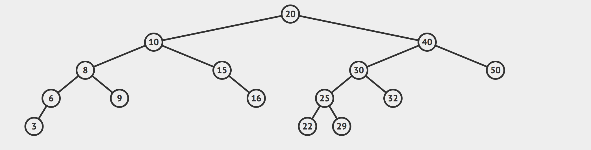

# Lowest Common Ancestor of a Binary Search Tree

Write a method on a `BinarySearchTree` class called `lowestCommonAncestor`. This method should take in two nodes and return the lowest node in the tree which is a common ancestor of the original two nodes.

You have been provided with a `BinarySearchTree` class, as well as a `BSTNode` class.

Notes:
  - A node can be its own lowest common ancestor.
  - You can assume that every node in the tree will have a unique value, and the values of the input nodes will be distinct. You can also assume that both inputs will be nodes in the tree.

Example: 



For the tree above:

```js
let bst = new BinarySearchTree;
let nodeValues = [20, 10, 40, 8, 15, 30, 50, 6, 9, 16, 25, 32, 3, 22, 29];
nodeValues.forEach(val => bst.insert(val));

let node3 = bst.find(3);
let node6 = bst.find(6);
let node9 = bst.find(9);
let node25 = bst.find(25);
let node50 = bst.find(50);

bst.lowestCommonAncestor(node3, node9);
// BSTNode { val: 8, left: BSTNode, right: BSTNode }

bst.lowestCommonAncestor(node25, node50);
// BSTNode { val: 40, left: BSTNode, right: BSTNode }

bst.lowestCommonAncestor(node9, node25);
// BSTNode { val: 20, left: BSTNode, right: BSTNode }

bst.lowestCommonAncestor(node3, node6);
// BSTNode { val: 6, left: BSTNode, right: null }
```

Companies that have asked this question:
  - 