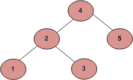

# Find the max height of a Binary Search Tree.

Write a method called `findMaxHeight` that takes a root node and returns an integer that represents the maximum height of a binary search tree.

Notes:
Height of empty tree is 0.

Example:



For the tree above:

```js
let bst = new BinarySearchTree();

bst.insert(4);
bst.insert(2);
bst.insert(5);
bst.insert(1);
bst.insert(3);

findMaxHeight(bst.root);
// 3
```

Companies that have asked this question:
