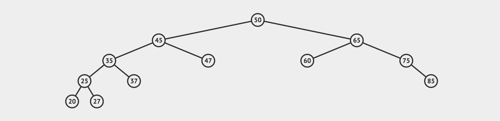
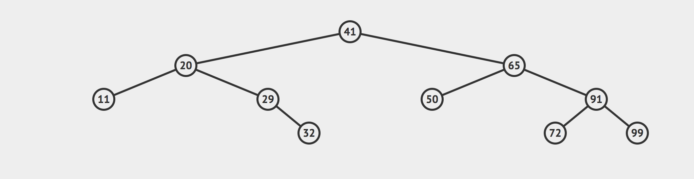

# Binary Search Tree Depth First Search - Post Order

Write a method on a `BinarySearchTree` class called `dfsPostOrder`. This method should return an array of values.

Definition Depth First Search:

**Depth-first search (DFS)** is an algorithm for traversing or searching tree or graph data structures. The algorithm starts at the root node (selecting some arbitrary node as the root node in the case of a graph) and explores as far as possible along each branch before backtracking. - [wikipedia](https://en.wikipedia.org/wiki/Depth-first_search)

**DFS Post Order** Postorder traversal is used to delete the tree. Please see the question for deletion of tree for details. Postorder traversal is also useful to get the postfix expression of an expression tree. - [geeksforgeeks](https://www.geeksforgeeks.org/tree-traversals-inorder-preorder-and-postorder/)


Post-order: A, C, E, D, B, H, I, G, F

Notes:

- You can assume all values are unique
- Assume all values are integers
- [Video of DFS-Post-Order](https://www.coursera.org/lecture/data-structures-optimizing-performance/core-post-order-in-order-and-level-order-traversals-breadth-first-search-zGs17)

Example 1: 


```js
let bst = BinarySearchTree();
let newNodes = [50, 45, 65, 35, 25, 20, 75, 60, 85, 47, 37, 27];

newNodes.forEach(val => bst.insert(val));

bst.dfsPostOrder(); // [ 20, 27, 25, 37, 35, 47, 45, 60, 85, 75, 65, 50]
```

Example 2:

```js
let bst = BinarySearchTree();
let newNodes = [41, 20, 65, 29, 11, 91, 50, 99, 72];

newNodes.forEach(val => bst.insert(val));

bst.dfsPostOrder(); // [11, 29, 20, 50, 72, 100, 99, 91, 65, 41]
```

Additional Resources To Read:

[Medium DFS](https://medium.com/basecs/demystifying-depth-first-search-a7c14cccf056) - NOTE: HAS A SOLUTION ON THE BOTTOM
[Rithm School](https://www.rithmschool.com/courses/javascript-computer-science-fundamentals/binary-search-trees-traversal)

Companies that have asked this question: